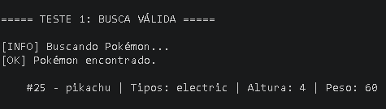
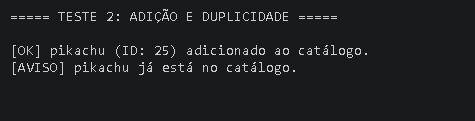
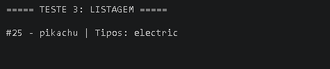
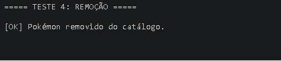
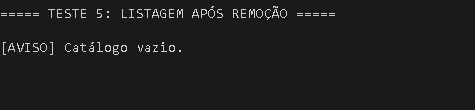
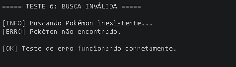

# ⚡ Pokedex TypeScript Lite


### 🎯 Objetivo

Desenvolver uma aplicação em TypeScript capaz de consumir dados da API pública PokeAPI, aplicar conceitos de tipagem, orientação a objetos e organização em camadas, além de permitir o gerenciamento de um catálogo de Pokémon no terminal.

O projeto tem como foco a prática de:

- Node.js;
- JavaScript no backend;
- TypeScript;
- Classes, Interfaces e Funções tipadas;
- Objetos, Arrays e JSON;
- Métodos de Array;
- Assincronicidade;
- Fetch;
- Tratamento de erros;
- GitHub, GitFlow e Kanban.

### 📌 Sobre o projeto

Este projeto consiste em uma aplicação TypeScript que consome a API pública da PokeAPI para buscar informações de Pokémons e gerenciar um catálogo em memória.

A aplicação segue uma arquitetura modular, separando responsabilidades em camadas como: service, models, controllers e utils.

---

### 🚀 Funcionalidades

- ✅ Buscar Pokémon por nome ou ID (integração com API)
- ✅ Mapear dados da API para modelo interno
- ✅ Adicionar Pokémon ao catálogo
- ✅ Evitar duplicidade no catálogo
- ✅ Listar Pokémon cadastrados
- ✅ Remover Pokémon por ID
- ✅ Tratar erros de busca (Pokémon inexistente)
- ✅ Exibição formatada no terminal

---

### 📂 Estrutura do Projeto

A aplicação segue uma organização em camadas, separando responsabilidades para melhor manutenção e escalabilidade:

```text
pokedex-typescript-lite/
│
├── src/
│    ├── controllers/
│    │    └── TerminalController.ts     # Orquestra o fluxo da aplicação
│    │
│    ├── services/
│    │    └── PokeApiService.ts        # Integração com a PokeAPI
│    │
│    ├── models/
│    │    ├── Pokemon.ts               # Interfaces e tipos
│    │    └── CatalogoPokemon.ts       # Regras de negócio
│    │
│    ├── utils/
│    │    └── formatters.ts            # Formatação de saída
│    │
│    └── main.ts                       # Ponto de entrada da aplicação
│
├── assets/
│    └── images/
│         ├── teste-adicao-duplicidade.png
│         ├── teste-busca-invalida.png
│         ├── teste-busca-valida.png
│         ├── teste-listagem-apos-remocao.png
│         ├── teste-listagem.png
│         └── teste-remocao.png
│
├── pc_box.json
├── package.json
├── tsconfig.json
└── README.md
```

### 🛠️ Tecnologias utilizadas

- Node.js
- TypeScript
- TSX
- PokeAPI
- Git
- GitHub

### ⚙️ Pré-requisitos

Antes de executar o projeto, é necessário ter instalado:

- Node.js
- npm
- Git

### ▶️ Como executar

1. Clone o repositório:

```bash
git clone https://github.com/helensjferreira-dev/pokedex-typescript-lite
```

2. Acesse a pasta do projeto:

```bash
cd pokedex-typescript-lite
```

3. Instale as dependências:

```bash
npm install
```

4. Execute o projeto em ambiente de desenvolvimento:

```bash
npm run dev
```

### 📸 Exemplos de execução

#### 🔹 Busca válida

Exemplo de busca de um Pokémon existente utilizando a PokeAPI, com retorno de dados formatados no terminal.

<p align="left">
  
</p>

---

#### 🔹 Adição e validação de duplicidade

Demonstração da adição de um Pokémon e da regra de negócio que impede inserir duplicados no catálogo.

<p align="left">
  
</p>

---

#### 🔹 Listagem de Pokémon

Exemplo da exibição dos Pokémon armazenados no catálogo, mostrando ID, nome e tipos.

<p align="left">
  
</p>

---

#### 🔹 Remoção de Pokémon por ID

Remoção de um Pokémon do catálogo utilizando seu ID, com mensagem de confirmação exibida no terminal.

<p align="left">
  
</p>

---

#### 🔹 Listagem após remoção

Exemplo da mensagem exibida quando o catálogo está vazio após a remoção.

<p align="left">
  
</p>

---

#### 🔹 Busca inválida

Demonstração do tratamento de erro ao tentar buscar um Pokémon inexistente na API.

<p align="left">
  
</p>


---

### 📚 Conceitos aplicados

Durante o desenvolvimento deste projeto, foram aplicados os seguintes conceitos:

- **Consumo de API externa**  
  Integração com a PokeAPI utilizando `fetch` para obter dados de Pokémon em tempo real.

- **Tipagem estática com TypeScript**  
  Utilização de interfaces (`PokemonApiResponse`, `PokemonResumo`) para garantir segurança e consistência dos dados.

- **Mapeamento de dados (Data Transformation)**  
  Transformação dos dados recebidos da API para um modelo interno mais simples e adequado ao uso da aplicação.

- **Programação Orientada a Objetos (POO)**  
  Uso de classes (`CatalogoPokemon`, `TerminalController`) para organizar responsabilidades e encapsular comportamentos.

- **Encapsulamento**  
  Controle de acesso aos dados do catálogo utilizando propriedades privadas (`private pokemons`).

- **Manipulação de arrays**  
  Uso de métodos como `.map()`, `.filter()` e `.some()` para transformação e controle dos dados.

- **Assincronicidade**  
  Uso de `async/await` para lidar com chamadas à API de forma não bloqueante.

- **Tratamento de erros**  
  Implementação de validações e blocos `try/catch` para lidar com falhas na requisição e dados inexistentes.

- **Separação de responsabilidades (arquitetura em camadas)**  
  Organização do código em componentes distintos:
  - Service → consumo da API  
  - Models → representação de dados  
  - Controller → controle do fluxo  
  - Utils → funções auxiliares (formatação)  

- **Formatação de dados para exibição**  
  Criação de funções utilitárias para apresentar informações de forma clara no terminal.

- **Versionamento com Git**  
  Uso de commits organizados seguindo padrão semântico (`feat`, `chore`, `test`, `docs`).

- **Organização de fluxo de desenvolvimento**  
  Aplicação de GitFlow e divisão do projeto em fases, garantindo evolução incremental e estruturada. 

---

### 📚 API utilizada

[🔗 Link da API](https://pokeapi.co/)


### 📋 Organização do Kanban

Visualização do fluxo de desenvolvimento no GitHub Projects (Kanban):

[🔗 Kanban](https://github.com/users/helensjferreira-dev/projects/4/views/1)


### 🌿 Branches utilizadas

- main;
- develop;
- feature/core-models;
- feature/api-integration;
- feature/catalog-rules;
- feature/controller-flow;
- feature/main-testing;
- docs/readme.

---

### 🚀 Melhorias futuras

Algumas possíveis evoluções para o projeto incluem:

- Implementação de uma interface de linha de comando (CLI) interativa, permitindo ao usuário inserir comandos em tempo real;  
- Persistência de dados em arquivo ou banco de dados (em vez de manter o catálogo apenas em memória);  
- Possibilidade de buscar e adicionar múltiplos Pokémon dinamicamente;  
- Implementação de remoção de Pokémon por nome, além do ID;  
- Inclusão de mais atributos dos Pokémon (como habilidades, estatísticas e sprites);  
- Criação de testes automatizados utilizando ferramentas como Jest;  
- Adição de tratamento de erros customizados;
- Implementação de paginação ou listagem mais avançada no catálogo.

---

👤 Autora  
Hélen Ferreira – Developer  
📸 [Linkedin](https://www.linkedin.com/in/helensjferreira-dev/)  
🔗 [GitHub](https://github.com/helensjferreira-dev/)
